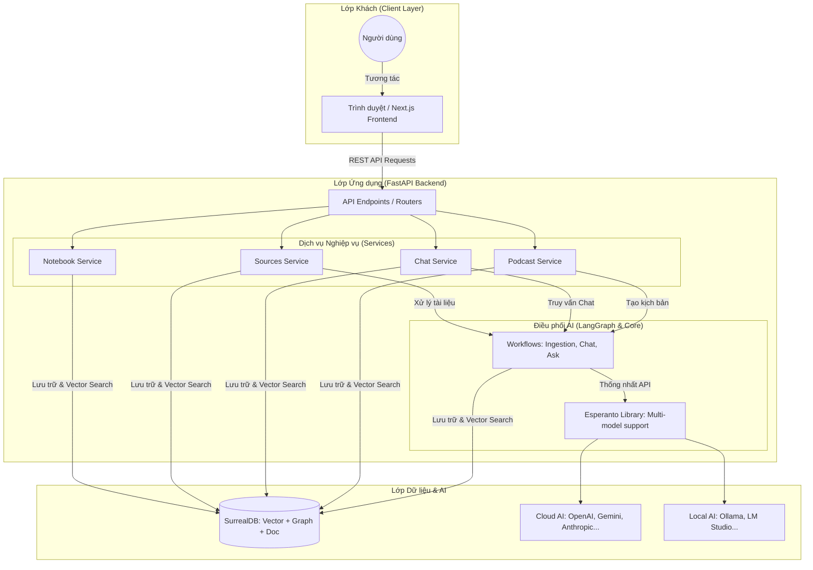

# Tài liệu Chi tiết Triển khai Open Notebook (Implementation Detail)

Tài liệu này giải thích chi tiết về kiến trúc hệ thống, luồng hoạt động của dữ liệu và các dịch vụ (services) bên trong Open Notebook.

---

## 1. Kiến trúc Tổng thể (High-Level Architecture)

Open Notebook sử dụng kiến trúc **3 lớp (Three-Tier Architecture)** được tối ưu hóa cho các tác vụ xử lý ngôn ngữ tự nhiên (AI/LLM) và tìm kiếm ngữ nghĩa:

1.  **Giao diện (Frontend)**: Next.js + React.
2.  **Ứng dụng (Backend API)**: FastAPI (Python).
3.  **Dữ liệu (Database)**: SurrealDB (Hỗ trợ Vector + Graph).

### Sơ đồ luồng giao tiếp:
```text
Browser <---> Frontend (8502) <---> Backend API (5055) <---> SurrealDB (8000)
                                           |
                                           +---> AI Providers (OpenAI, Gemini, Ollama...)
```

### Sơ đồ Kiến trúc Chi tiết (Mermaid):



---

## 2. Các Dịch vụ Cốt lõi (Core Services)

Trong mã nguồn tại thư mục `api/`, hệ thống được chia thành các service chuyên biệt:

### Quản lý Dữ liệu & Notebook
*   **NotebookService**: Quản lý các "quyển vở" nghiên cứu, bao gồm tạo mới, lưu trữ và cấu hình.
*   **SourcesService**: Xử lý việc nạp tài liệu (PDF, URL, YouTube...). Service này trích xuất văn bản (Parsed Text) và chuẩn bị cho việc đánh chỉ mục.
*   **NotesService**: Quản lý các ghi chú do người dùng viết hoặc do AI tạo ra.

### Trí tuệ Nhân tạo (AI & LLM)
*   **ChatService**: Quản lý lịch sử trò chuyện và thực hiện các phiên chat với AI.
*   **ModelsService**: Quản lý danh sách các mô hình AI có sẵn và cấu hình nhà cung cấp (API Keys).
*   **TransformationsService**: Thực hiện các tác vụ biến đổi dữ liệu như: tóm tắt, trích xuất ý chính, tạo câu hỏi Q&A từ tài liệu.

### Tìm kiếm & Podcast
*   **SearchService**: Thực hiện tìm kiếm kết hợp (Hybrid Search) giữa tìm kiếm từ khóa truyền thống và tìm kiếm vector (Semantic Search).
*   **PodcastService**: Dịch vụ phức tạp nhất, chịu trách nhiệm tạo kịch bản đa nhân vật và chuyển đổi thành âm thanh (TTS).

---

## 3. Luồng Hoạt động Dữ liệu (Workflows)

Hệ thống sử dụng **LangGraph** để điều phối các luồng xử lý AI phức tạp. Dưới đây là 3 luồng quan trọng nhất:

### A. Luồng Nạp Tài liệu (Ingestion Workflow)
1.  Người dùng upload file hoặc dán link.
2.  `content-core` trích xuất văn bản thô.
3.  Văn bản được chia nhỏ (Chunking) thành các đoạn khoảng 500-1000 từ.
4.  Mỗi đoạn được gửi đến model Embedding để tạo ra một vector số.
5.  Văn bản + Vector được lưu vào **SurrealDB**.

### B. Luồng Trò chuyện (Chat/RAG Workflow)
1.  Người dùng đặt câu hỏi.
2.  Hệ thống lấy câu hỏi đi tìm kiếm các đoạn văn bản liên quan nhất trong Database (Vector Search).
3.  **Context Building**: Gom các đoạn văn bản đó làm "kiến thức tạm thời" cho AI.
4.  Gửi Prompt (Kiến thức + Câu hỏi) đến LLM.
5.  AI trả về câu trả lời kèm theo trích dẫn (Citations) chính xác từ tài liệu gốc.

### C. Luồng Tạo Podcast (Podcast Workflow)
1.  Dựa trên toàn bộ tài liệu trong Notebook, AI tạo ra một kịch bản đối thoại tự nhiên giữa 2 hoặc nhiều nhân vật.
2.  Kịch bản được chia thành các câu thoại gắn liền với từng giọng đọc.
3.  Gửi đến dịch vụ Text-to-Speech (như OpenAI TTS hoặc ElevenLabs).
4.  Ghép các file âm thanh lại thành một bản Podcast hoàn chỉnh.

---

## 4. Công nghệ Cơ sở dữ liệu (SurrealDB)

Dự án chọn SurrealDB vì đây là một DB "tất cả trong một":
*   **Vector Database**: Lưu trữ các vector embedding và cho phép tìm kiếm tương đồng (cosine similarity).
*   **Graph Database**: Quản lý mối quan hệ phức tạp giữa Notebook -> Source -> Note.
*   **Schemafull/Schemaless**: Linh hoạt trong việc thay đổi cấu trúc dữ liệu AI.

---

## 5. Tích hợp Đa Mô hình (Esperanto Library)

Dự án sử dụng một thư viện trung gian tên là `esperanto`. Nó cho phép:
*   Đổi nhà cung cấp AI trong 1 giây (ví dụ: đang dùng OpenAI chuyển sang dùng máy nhà qua Ollama).
*   Thống nhất định dạng input/output cho mọi model llm.
*   Tự động tính toán số lượng Token và chi phí ước tính.

---
*Tài liệu này được tạo tự động để hỗ trợ quá trình tìm hiểu mã nguồn Open Notebook.*
