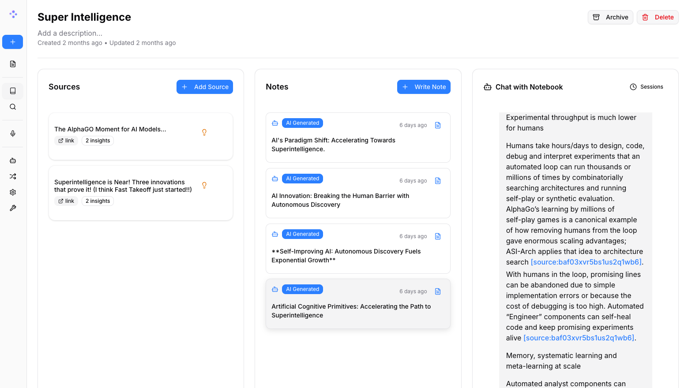

<a id="readme-top"></a>

<div align="center">
    

  <h3 align="center">DocuMind</h3>

  <p align="center">
    Giải pháp mã nguồn mở, ưu tiên quyền riêng tư thay thế cho Google Notebook LM!
    <br />
    <br />
    <a href="README.md"><strong>English Version »</strong></a>
    <br />
    <br />
    <a href="docs/vi/0-START-HERE/index.md">📚 Bắt đầu</a>
    ·
    <a href="docs/vi/3-USER-GUIDE/index.md">📖 Hướng dẫn sử dụng</a>
    ·
    <a href="docs/vi/2-CORE-CONCEPTS/index.md">✨ Tính năng</a>
    ·
    <a href="docs/vi/1-INSTALLATION/index.md">🚀 Triển khai</a>
  </p>
</div>

## Một giải pháp thay thế Notebook LM: Riêng tư, Đa mô hình, 100% Local, Đầy đủ tính năng



Trong một thế giới bị thống trị bởi Trí tuệ Nhân tạo, khả năng tư duy 🧠 và tiếp thu kiến thức mới 💡 là một kỹ năng không nên là đặc quyền của một số ít người, cũng như không nên bị giới hạn bởi một nhà cung cấp duy nhất.

**DocuMind giúp bạn:**
- 🔒 **Kiểm soát dữ liệu của bạn** - Giữ cho nghiên cứu của bạn riêng tư và an toàn.
- 🤖 **Tự chọn mô hình AI** - Hỗ trợ 5 nhà cung cấp cốt lõi bao gồm OpenAI, Google AI, Ollama, ElevenLabs và đặc biệt là các mô hình Tiếng Việt local (ViT5/PhoBERT).
- 📚 **Tổ chức nội dung đa phương tiện** - PDF, video, âm thanh, trang web và nhiều hơn nữa.
- 🎙️ **Tạo Podcast chuyên nghiệp** - Thế hệ podcast đa người nói tiên tiến.
- 🔍 **Tìm kiếm thông minh** - Tìm kiếm toàn văn và tìm kiếm vector trên toàn bộ nội dung của bạn.
- 💬 **Chat với ngữ cảnh** - Các cuộc hội thoại AI được cung cấp năng lượng bởi chính tài liệu nghiên cứu của bạn.
- 🌐 **Giao diện đa ngôn ngữ** - Hỗ trợ Tiếng Anh và Tiếng Việt.

---

## 🆚 DocuMind vs Google Notebook LM

| Tính năng | DocuMind | Google Notebook LM | Ưu thế |
|---------|---------------|--------------------|-----------|
| **Quyền riêng tư & Kiểm soát** | Tự lưu trữ, dữ liệu của bạn | Chỉ trên đám mây Google | Chủ quyền dữ liệu hoàn toàn |
| **Lựa chọn Nhà cung cấp AI** | 5 nhà cung cấp (OpenAI, Google, Local...) | Chỉ mô hình Google | Linh hoạt và tối ưu chi phí |
| **Người nói Podcast** | 1-4 người nói với hồ sơ tùy chỉnh | Chỉ 2 người nói | Cực kỳ linh hoạt |
| **Chuyển đổi nội dung** | Tùy chỉnh và tích hợp sẵn | Lựa chọn hạn chế | Khả năng xử lý không giới hạn |
| **Truy cập API** | Full REST API | Không có API | Tự động hóa hoàn toàn |
| **Triển khai** | Docker, cloud, hoặc local | Chỉ Google host | Triển khai mọi nơi |
| **Trích dẫn** | Tham chiếu cơ bản (đang cải thiện) | Toàn diện với nguồn | Tính chính trực trong nghiên cứu |
| **Tùy biến** | Mã nguồn mở, hoàn toàn tùy biến | Hệ thống đóng | Khả năng mở rộng không giới hạn |

**Tại sao chọn DocuMind?**
- 🔒 **Quyền riêng tư là trên hết**: Nghiên cứu nhạy cảm của bạn luôn được giữ kín hoàn toàn.
- 💰 **Kiểm soát chi phí**: Chọn nhà cung cấp AI rẻ hơn hoặc chạy local hoàn toàn với Ollama/ViT5.
- 🎙️ **Podcast tốt hơn**: Kiểm soát toàn bộ kịch bản và linh hoạt đa người nói.
- 🔧 **Tùy biến không giới hạn**: Chỉnh sửa, mở rộng và tích hợp theo nhu cầu.
- 🇻🇳 **Tối ưu Tiếng Việt**: Tích hợp sẵn ViT5 để tóm tắt và PhoBERT để hỏi đáp tiếng Việt.

---

## 📊 Ma trận hỗ trợ Nhà cung cấp

| Nhà cung cấp      | Hỗ trợ LLM | Nhúng (Embedding) | Chuyển giọng nói | Tạo giọng nói |
|-------------------|------------|-------------------|------------------|---------------|
| OpenAI            | ✅         | ✅                | ✅               | ✅            |
| Google AI         | ✅         | ✅                | ❌               | ✅            |
| Ollama            | ✅         | ✅                | ❌               | ❌            |
| ElevenLabs        | ❌         | ❌                | ✅               | ✅            |
| Local (ViT5/QA)   | ✅         | ❌                | ❌               | ❌            |

---

## 🚀 Bắt đầu nhanh (2 phút)

### Điều kiện tiên quyết
- Đã cài đặt [Docker Desktop](https://www.docker.com/products/docker-desktop/)

### Bước 1: Lấy file docker-compose.yml
Sao chép nội dung sau vào một file mới tên là `docker-compose.yml`:

```yaml
services:
  surrealdb:
    image: surrealdb/surrealdb:v2
    command: start --log info --user root --pass root rocksdb:/mydata/mydatabase.db
    user: root
    ports:
      - "8000:8000"
    volumes:
      - ./surreal_data:/mydata
    restart: always

  documind:
    image: tandoan/documind:latest
    ports:
      - "8502:8502"
      - "5055:5055"
    environment:
      - OPEN_NOTEBOOK_ENCRYPTION_KEY=thay-bang-mot-chuoi-bi-mat
      - SURREAL_URL=ws://surrealdb:8000/rpc
      - SURREAL_USER=root
      - SURREAL_PASSWORD=root
      - SURREAL_NAMESPACE=documind
      - SURREAL_DATABASE=documind
    volumes:
      - ./notebook_data:/app/data
    depends_on:
      - surrealdb
    restart: always
```

### Bước 2: Thiết lập Encryption Key
Chỉnh sửa `docker-compose.yml` và thay đổi dòng:
`- OPEN_NOTEBOOK_ENCRYPTION_KEY=thay-bang-mot-chuoi-bi-mat`
thành bất kỳ giá trị bí mật nào của bạn.

### Bước 3: Khởi chạy
```bash
docker compose up -d
```
Đợi 15-20 giây, sau đó mở: **http://localhost:8502**

---

## ✨ Các tính năng chính

### Khả năng cốt lõi
- **🔒 Ưu tiên quyền riêng tư**: Dữ liệu nằm dưới sự kiểm soát của bạn - không phụ thuộc vào đám mây.
- **🎯 Tổ chức đa Notebook**: Quản lý nhiều dự án nghiên cứu một cách liền mạch.
- **📚 Hỗ trợ nội dung đa dạng**: PDF, video, âm thanh, trang web, tài liệu Office và nhiều hơn nữa.
- **🤖 Hỗ trợ đa mô hình AI**: Hỗ trợ OpenAI, Google, Ollama và các mô hình Tiếng Việt local.
- **🔍 Tìm kiếm thông minh**: Tìm kiếm toàn văn và tìm kiếm vector (RAG) hiệu quả.
- **💬 Chat theo ngữ cảnh**: Hội thoại AI dựa trên chính tài liệu của bạn.

### Tính năng nâng cao
- **⚡ Hỗ trợ mô hình suy luận**: Hỗ trợ đầy đủ các mô hình như DeepSeek-R1 và Qwen3.
- **🔧 Chuyển đổi nội dung (Insights)**: Các hành động tùy chỉnh mạnh mẽ để tóm tắt và trích xuất thông tin.
- **🌐 REST API toàn diện**: Truy cập lập trình đầy đủ để tích hợp tùy chỉnh.
- **🔐 Bảo vệ bằng mật khẩu**: Triển khai công khai an toàn với xác thực.

---

## 📄 Bản quyền

DocuMind được cấp phép theo giấy phép MIT. Xem file [LICENSE](LICENSE) để biết thêm chi tiết.

**Hỗ trợ cộng đồng**:

<p align="right">(<a href="#readme-top">về đầu trang</a>)</p>
